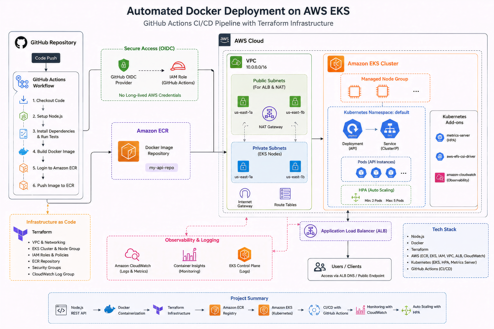

# Automated Containerized CI/CD Deployment on AWS

A Cloud/DevOps project that automates the deployment of a containerized Node.js REST API to Amazon EKS.

The project uses Docker for containerization, Terraform for AWS infrastructure, Kubernetes for orchestration, and GitHub Actions for CI/CD. A code push to the `main` branch runs tests, builds and publishes a Docker image to Amazon ECR, and updates the Kubernetes deployment automatically.

## Architecture



## Tech Stack


## Application

The application is a small Node.js REST API. It is intentionally simple so the focus stays on the deployment and infrastructure side of the project.

### Health Check

```http
GET /health
```

Example response:

```json
{
  "status": "healthy",
  "message": "API is running"
}
```

### Tasks API

```http
GET /api/tasks
```

## CI/CD Pipeline

Every push to the `main` branch triggers the GitHub Actions workflow.

The pipeline performs the following steps:

1. Checks out the repository.
2. Sets up Node.js.
3. Installs dependencies using `npm ci`.
4. Runs the application tests.
5. Builds the Docker image.
6. Tags the image using the Git commit SHA.
7. Pushes the image to Amazon ECR.
8. Authenticates with the EKS cluster.
9. Updates the Kubernetes Deployment with the new image.
10. Waits for the rollout to complete.

Using the Git commit SHA as the Docker image tag makes each deployment traceable to a specific version of the source code.

## AWS Authentication

GitHub Actions uses GitHub's OpenID Connect (OIDC) integration to authenticate with AWS.

A dedicated IAM role is assumed by the workflow instead of storing long-lived AWS access keys in GitHub.

The workflow is restricted to the project's `main` branch, and Kubernetes RBAC controls what the GitHub Actions identity can do inside the cluster.

## Infrastructure

AWS infrastructure is managed with Terraform.

The project includes the infrastructure required for:

- VPC networking
- ECR
- EKS
- EKS managed nodes
- IAM roles
- Supporting AWS networking resources

Terraform provides a repeatable way to create and manage the infrastructure instead of relying entirely on manually created AWS resources.

Typical workflow:

```bash
terraform init
terraform plan
terraform apply
```

To remove the Terraform-managed infrastructure:

```bash
terraform destroy
```

## Kubernetes

The application runs in the `automated-dep` namespace.

The Kubernetes configuration includes:

- **Deployment** — manages the application pods and rolling updates.
- **Service** — exposes the application through an AWS Load Balancer.
- **ConfigMap** — provides non-sensitive application configuration.
- **HPA** — scales the deployment based on CPU utilization.
- **Metrics Server** — provides resource metrics to Kubernetes.
- **Health probes** — allow Kubernetes to determine whether containers are ready and healthy.
- **Resource requests and limits** — define CPU and memory requirements.
- **RBAC** — controls the permissions used by GitHub Actions during deployment.

The HPA is configured with:

```text
Minimum replicas: 2
Maximum replicas: 4
CPU target: 70%
```

## Monitoring and Troubleshooting

EKS control-plane logging is enabled for:

- API server
- Audit
- Authenticator
- Controller Manager
- Scheduler

Some useful commands for checking the application:

```bash
kubectl get pods -n automated-dep
kubectl get deployment -n automated-dep
kubectl get service -n automated-dep
kubectl get hpa -n automated-dep
kubectl top nodes
kubectl logs deployment/automated-dep-api -n automated-dep
```

Deployment health can be checked with:

```bash
kubectl rollout status deployment/automated-dep-api -n automated-dep
```

The project also involved troubleshooting a failed image deployment that resulted in `ImagePullBackOff`. The pod events were inspected with `kubectl describe pod`, the incorrect image reference was identified, and the deployment was recovered using Kubernetes rollout controls.

## Docker

The application can be built locally with:

```bash
docker build -t automated-dep-aws-api .
```

Run the container:

```bash
docker run -p 3000:3000 automated-dep-aws-api
```

Then test:

```bash
curl http://localhost:3000/health
```

## Running Locally

Clone the repository:

```bash
git clone https://github.com/bilalahsd/automated-containerized-cicd-aws.git
cd automated-containerized-cicd-aws
```

Install the application dependencies:

```bash
cd app
npm install
```

Start the API:

```bash
npm start
```

The application runs on:

```text
http://localhost:3000
```

Test the health endpoint:

```bash
curl http://localhost:3000/health
```

## Repository Structure

```text
automated-containerized-cicd-aws/
│
├── app/
│   ├── server.js
│   ├── package.json
│   └── package-lock.json
│
├── k8s/
│   ├── namespace.yaml
│   ├── deployment.yaml
│   ├── service.yaml
│   ├── configmap.yaml
│   └── hpa.yaml
│
├── terraform/
│   └── main.tf
│
├── .github/
│   └── workflows/
│       └── ci.yml
│
├── Dockerfile
├── .dockerignore
└── README.md
```

## Deployment Flow

After the initial AWS and Kubernetes infrastructure is available, deploying a new application version is as simple as:

```bash
git add .
git commit -m "Update application"
git push origin main
```

GitHub Actions then handles the deployment:

```text
Git push
   ↓
Tests
   ↓
Docker build
   ↓
Amazon ECR
   ↓
Amazon EKS
   ↓
Kubernetes rollout
   ↓
Updated application
```

## Project Outcome

The final setup provides an end-to-end CI/CD workflow for a containerized application running on AWS.

A change pushed to GitHub can be automatically tested, packaged as a Docker image, stored in Amazon ECR, and deployed to Amazon EKS without manually updating the Kubernetes deployment.

The deployment was verified through Kubernetes rollout checks and the public `/health` endpoint.

## Key Takeaways

This project was built to get practical experience with:

- Docker image creation and versioning
- GitHub Actions CI/CD
- AWS IAM and OIDC authentication
- Amazon ECR
- Amazon EKS
- Kubernetes deployments and services
- Kubernetes health checks
- Horizontal Pod Autoscaling
- Terraform Infrastructure as Code
- AWS networking
- CI/CD deployment troubleshooting
- Rolling updates and rollbacks